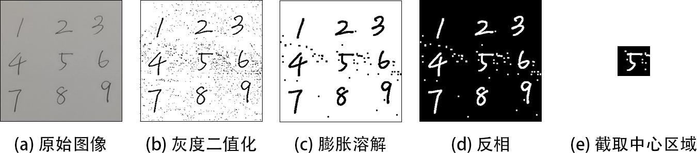

# 基于视频信息处理的手写数字识别系统

## 运行指南

创建一个Python3.9的环境

```
conda create -n test python=3.9
conda activate test
```

安装依赖库

```
pip install -r requirements.txt
```

外接USB摄像头之后，执行 *video.py* 可以识别中心框内的数字和置信度，非数字时显示 "N/A"。

```
python video.py
```

退出使用按键'q'。

<p align="center"></p>
<p align="center">图 视频流中手写数字识别的结果</p>


## 模型复现

如果需要重新训练模型，建议使用带有cuda的独立显卡，并安装 [*tensorflow-gpu*](https://www.tensorflow.org/install/gpu?hl=zh-cn)。

请执行 *model.py*。此时训练数据没有经过增强。

如果需要数据增强，请打开以下注释并指定扩增倍数（默认20倍）：

```python
# 数据增强(模拟摄像头输入), 数据扩增 20 倍，训练集，键盘输入‘y’保存到本地
Augument_MNIST(N_times=20)
```

数据增广的代码存放在 *augment.py*。


--- 
# 报告部分

## 项目框架

考虑模型构建和训练的便捷性，本项目使用了Python语言作为编程环境，深度学习框架选择Tensorflow和Keras，数据处理和模型训练在一台搭载Nvidia独立显卡的Windows机器上进行。USB摄像头图像获取和视觉处理使用了OpenCV，推理部署使用了Keras库。

## 视频信息获取与处理


<p align="center"></p>
<p align="center">图 视觉处理流程</p>


## 分类模型

用于手写字识别的分类模型采用的是CNN网络，主要由3个卷积层、池化层和全连接层构成，通过这些层的堆叠来提取图像的特征并进行分类。

该模型的结构如下：
- 输入向量：形状为(28, 28, 1)，表示单通道的28x28像素的图像。
- 卷积层：3层卷积层组成，卷积核数量分别为32,64,128，卷积核大小为3x3，激活函数为ReLU，后面接2x2的池化层，最后一个卷积层的输出展平为1维。
- 全连接层：2层全连接层，第一层油128个神经元，激活函数为ReLU。第二层10个神经元，激活函数为Softmax，用于进行分类。
- 输出向量：10维one-hot编码的分类结果。


<p align="center"></p>
<p align="center">图 卷积网络定义</p>

## 数据集构建

### MNIST 数据集

> Y. LeCun, L. Bottou, Y. Bengio, and P. Haffner. "Gradient-based learning applied to document recognition." Proceedings of the IEEE, 86(11):2278-2324, November 1998.

MNIST 手写数字数据集由60000个训练数据和10000个测试数据构成，每个数据包含一张大小为28x28的灰度图，和对应的0~9编码的分类标注。训练前先把图片标准化为范围[0,1]的矩阵，标注转换成 one-hot 编码，便于计算交叉熵损失。

对于网络的训练，随机抽取MNIST训练集中的90%作为训练集，剩余10%数据作为验证集，用于确定训练超参数。最后，使用所有测试集检验精度。所以，训练：验证：测试 = 54000：6000：10000。

<p align="center"></p>
<p align="center">图 MNIST 数据集</p>


### 数据增强

由于MNIST数据集与实际摄像头采样得到的数据具有一定差异，如果直接使用MNIST数据集进行训练，得到的模型将对位移和噪声敏感。为了训练更加鲁棒的模型，这里对训练集采取了一些图像处理，使其贴合真实情况的数据。具体的步骤如下：


<p align="center"></p>
<p align="center">图 数据增强过程</p>

- 原始数据是一些手写数字笔画的灰度图。
- 随机旋转、平移、剪切、缩放。这是为了模拟摄像机在拍摄时的抖动位移。
- 添加随机高斯噪声。这是为了模拟纸张凹凸不平和摄像头曝光等因素导致的背景颜色不均匀。实际中采用了三种粒度的高斯噪声进行叠加，模拟各种尺度的颜色不均匀。
- 二值化、添加盐粒噪声。盐粒噪声进行了降采样和升采样，以增加其尺寸和尺寸复杂度。这是因为我们在获取摄像头拍摄的帧之后，对帧图像做二值化，这个过程中会因为光照不均等因素产生一些噪声。最终得到只有0和1的二值图。

采用上述步骤对训练集进行了20倍的扩增，然后与原始数据合并，得到一个大小为3.72GB的增广数据集，以.npy格式储存。如此处理，大大增加了训练集的规模和拟真度。

## 模型训练

### 损失函数和精度计算

模型的损失函数使用分类交叉熵（categorical cross-entropy）损失。交叉熵通过对每个类别的预测概率与真实标签的对数进行加权求和来度量预测结果与真实结果之间的差异。负号表示最小化交叉熵，以便在训练过程中最大程度地减少预测与真实结果之间的差异。损失函数计算方法为：

$$
\text{Loss}(y, \hat{y}) = -\sum_{i=1}^{N} y_i \log(\hat{y}_i)
$$

其中，$y$ 是真实的类别标签，$\hat{y}$ 是模型的预测概率分布，$N$ 是类别的总数。$y_i$ 表示真实类别 $i$ 的标签值，$\hat{y}_i$ 表示模型对类别 $i$ 的预测概率。


模型的预测精度采用了平均分类正确率，计算了所有样本的正确预测数平均值：

$$
\text{Acc}(y, \hat{y}) = \frac{1}{N} \sum_{i=1}^{N} I(\hat{y}_i = y_i)
$$

### 训练优化

如果采用SGD训练网络，可能需要多次调整学习率才能得到到最佳的训练超参数。而Adam优化器是RMSProp和动量法结合的产物，使用它的好处是学习率的选择较为宽松，训练采用学习率=0.001。

<p align="center"></p>
<p align="center">图 预训练过程损失曲线和精度曲线</p>

为了确定训练轮数，首先训练了15轮。可见训练10轮以上之后，模型在验证集上没有明显提升，因此确定训练轮数为10。合并训练集和验证集，分别在MNIST训练集和增广训练集上进行10轮训练，得到两种模型。


### 测试结果

在MNIST原始训练集上训练得到的模型，在10000张图片的MNIST测试集上运行，得到了99.08%的测试精度，而增广数据集训练得到的模型也获得了非常接近的99.02%的测试精度。

然而，MNIST测试集和实际摄像头采集到的图像是有明显差异的，没有包含摄像头带来的图像损失，因此这个精度并不能直接反映模型在实际运行时的推理精度。

在原始MNIST训练集和增广数据集上训练得到的两种模型，都部署在摄像头上进行实时推理，通过移动摄像头，我们可以很容易的发现两种训练集带来的差异。通过原始MNIST数据集训练的模型，在遇到数字不居中、噪声的干扰的情况，很容易有误识别；而通过增广数据集训练的模型，对数字的识别快速、稳定。因此，从实际测试的情况来看，对MNIST数据集进行数据增强，对于摄像头的手写数字识别任务的是十分有效的。