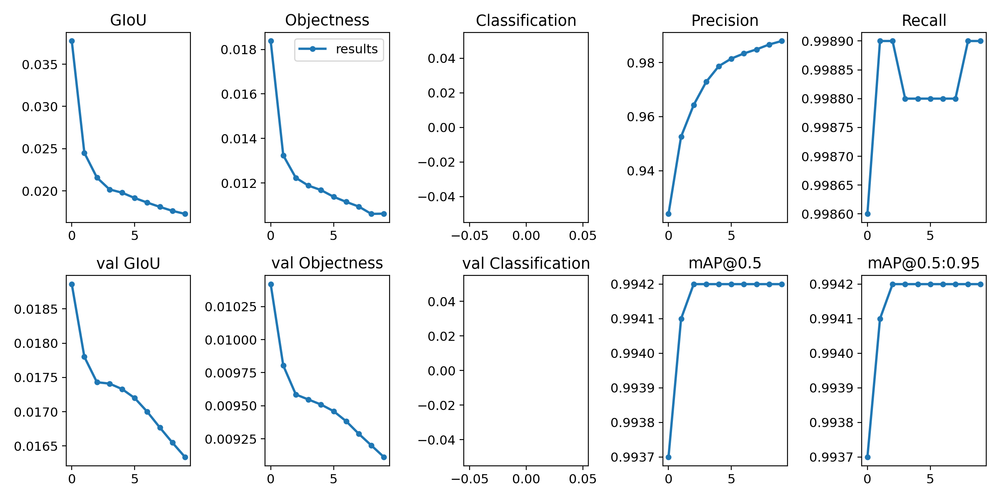
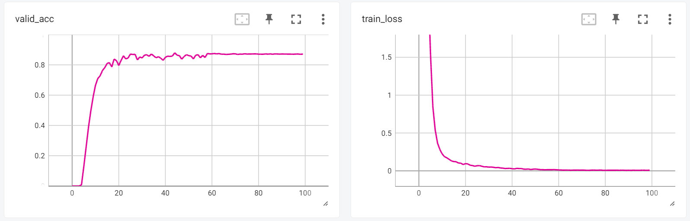

这个项目是使用 YOLOv5s 和 CRNN 对 CCPD 车牌进行检测和识别。

主要参考以下2个仓库：

1. Github: [https://github.com/we0091234/crnn_plate_recognition](https://github.com/we0091234/crnn_plate_recognition)
2. Github: [https://github.com/ultralytics/yolov5](https://github.com/ultralytics/yolov5)

## Demo 效果演示

```
conda deactivate
conda create -n test python=3.8
conda activate test
pip install -r requirements.txt 
```

准备一个测试视频 *example.mp4* 运行 `main.py` 查看效果
```
python main.py --source path/to/example.mp4
```

##  训练和测试 YOLOv5

### CCPD数据集准备和划分

CCPD数据集下载地址: https://github.com/detectRecog/CCPD. 总共有2个压缩包 *CCPD2019.tar.xz* 和 *CCPD2020.zip*

1. 在脚本目录的上一级目录新建一个 */CCPD* 文件夹, 将 *CCPD2019.tar.xz* 和 *CCPD2020.zip* 放在里面。

2. 运行脚本`ccpd_preprocess.py`解压和划分训练集, 默认按照 *train: val: test = 8: 1: 1* 随机划分。

3. 运行脚本`ccpd2yolov5.py`CCPD数据集转YOLOv5格式, 解码, 剔除错误数据, 生成标签。

最终数据格式与 *data/ccpd.yaml* 规定的一致，否则不能训练。

### 训练YOLOv5

脚本`train_yolov5.py`用于YOLOv5的训练
- 文件开头的 *hyp* 定义了训练超参数  *optimizer, initial learning rate, momentum / beta1...*
- *main* 函数内指定了训练设置 *device, batch_size, epochs...*

推荐提前安装 Nvidia-Apex 进行混合精度训练（节约显存和加速）:

```bash
git clone https://github.com/NVIDIA/apex
cd apex
python setup.py
```

可使用  `tensorboard --logdir=runs --port=6007` 启动 Tensorboard, 然后在浏览器输入 http://localhost:6007/ 查看

进行 10 轮训练的结果：


### 测试YOLOv5

测试可以使用 `test_yolov5.py`

|Images|     Targets|           P|           R|      mAP@.5|  mAP@.5:.95|
|--    |          --|          --|          --|          --|          --|
|3.59e+04|  3.59e+04|       0.992|       0.999|       0.994|       0.994|

## 训练和测试 CRNN

数据集采用 [we0091234](https://github.com/we0091234/crnn_plate_recognition) 从CCPD和CRPD截下来的车牌小图和收集的一部分车牌，已经划分训练集和验证集:
- [https://pan.baidu.com/s/1xT-F3E5U3ul3o6gu6Zk94g](https://pan.baidu.com/s/1xT-F3E5U3ul3o6gu6Zk94g)  提取码：*g08q*


这里偷了个懒，没有自己从CCPD里面去截取车牌。

1. 在目录的上一级目录新建一个 */CCPD_LISENCE* 文件夹, 将 *train_plate.tar.gz* 和 *val_verify.rar* 放在里面

2. 然后执行 `ccpd_license_preprocess.py` 脚本解压和解码，得到 train.txt 和 val.txt 

- 包含 *train_plate.tar.gz* 和 *val_verify.rar*  , 图片命名如：*“车牌号_序号.jpg”*。
- 解压得到的数据已经使用 [Text-Image-Augmentation](https://github.com/RubanSeven/Text-Image-Augmentation-python) 进行了数据增广。


3. 最后执行 `train_rcnn.py` 脚本进行训练。
- *lib/config/360CC_config.yaml* 指定了训练设置和参数。

可使用  `tensorboard --logdir=output/360CC/crnn --port=6007` 启动 Tensorboard, 然后在浏览器输入 http://localhost:6007/ 查看

经过 100 轮训练的结果:



脚本 `test_rcnn.py` 用于测试 RCNN 网络，由于没有划分测试集，只有训练过程中的验证精度。
