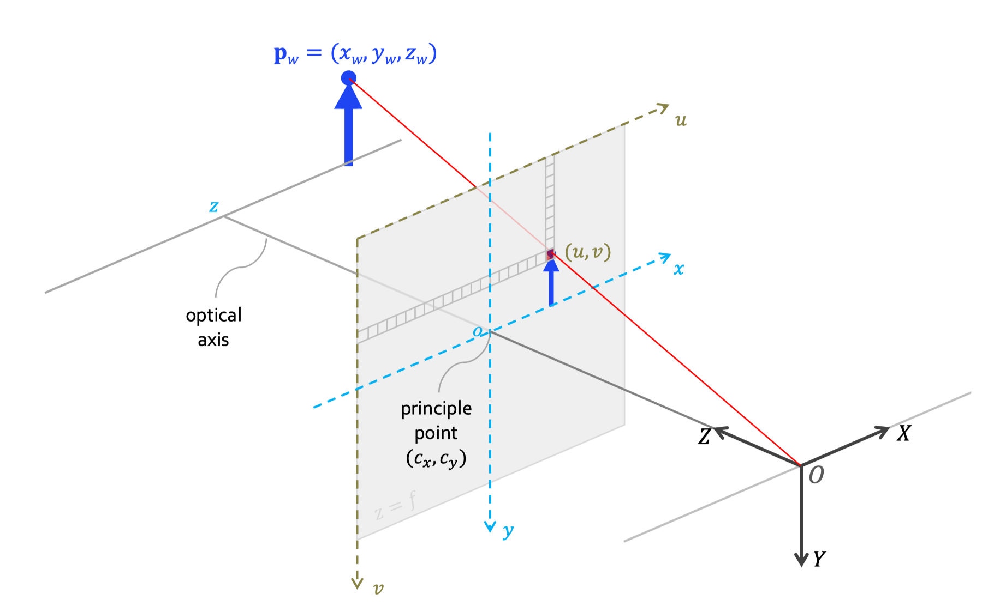
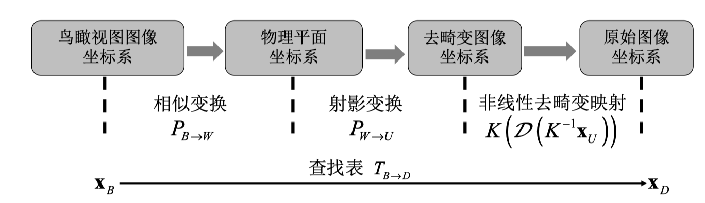

# 实践三 车速和撞线时间估计

<!-- ## 标准参照物
依照国标 [《城镇化地区公路工程技术标准》（JTG 2112—2021）](https://xxgk.mot.gov.cn/2020/jigou/glj/202112/P020220106356485472287.pdf)，该路段车道宽度为3.25m

https://arxiv.org/abs/2101.06159

厂商: Huawei
模型: Honor X10
手机重量: 191g
手机尺寸: 163.7 x 76.5 x 8.8mm
操作系统版本: Android 10.0 (Q)
主屏尺寸: 6.63英寸
主屏分辨率: 2400x1080
RAM 容量: 6GB
ROM 容量: 64GB
摄像头: 40Mp Sony IMX600
40 MP, f/1.8, 26 mm ( 广角 ), 1/1.7" 传感器尺寸
Resolution  7296 x 5472, 39.92 Mega-pixels
Matrix size  7.3 mm x 5.47 mm, Diagonal: 0.46 inch
Pixel size  1 μm -->

设三维世界坐标系中的 $\mathbf{p}_w$ 点坐标为 $\mathbf{p}_w = (x_w,y_w,z_w,1)^T$（齐次坐标表示）。相机自身也建立了一个三维坐标系，称为相机坐标系，这个坐标系以相机的光心 $O$ 为坐标原点，其三个正交坐标轴被表示为 $X$、$Y$ 和 $Z$。由于相机坐标系和世界坐标系之间的关系可以通过旋转和平移来刻画，因此，点 $\mathbf{p}_w$ 在相机坐标系下的坐标 $\mathbf{p}_c$ 可被表达为，

$$
\mathbf{p}_c=\begin{bmatrix}R_{3\times3}&\mathbf{t}_{3\times1}\end{bmatrix}\mathbf{p}_w=\begin{bmatrix}R_{3\times3}&\mathbf{t}_{3\times1}\end{bmatrix}\begin{bmatrix}x_w\\y_w\\z_w\\1\end{bmatrix}\triangleq\begin{bmatrix}x_c\\y_c\\z_c\end{bmatrix}\tag{1}
$$

相机的成像平面为一个到光心 $O$ 的距离为 $f$、垂直于 $Z$ 轴且在 $Z$ 轴正向的一个平面。在这个平面上，我们定义成像平面坐标系。根据相似三角形的知识容易知道，$\mathbf{p}_c$ 在成像平面坐标系下的投影点的坐标$(x, y)^T$ 为，
$$
\begin{cases}x=f\dfrac{x_c}{z_c}\\{}\\y=f\dfrac{y_c}{z_c}&\end{cases}\tag{2}
$$

其齐次坐标表达为
$$
\begin{bmatrix}x\\y\\1\end{bmatrix}=\frac{1}{z_c}\begin{bmatrix}f&0&0\\0&f&0\\0&0&1\end{bmatrix}\begin{bmatrix}x_c\\y_c\\z_c\end{bmatrix} \tag{3}
$$

构建一归一化成像平面到光心 $O$ 的距离为单位“1”，
即$f=1$，便可以得到点 $\mathbf{p}_c$ 在归一化成像平面上投影点的齐次坐标 $(x_n , y_n , 1)^T$ ，
$$
\begin{bmatrix}x_n\\y_n\\1\end{bmatrix}=\frac{1}{z_c}\begin{bmatrix}x_c\\y_c\\z_c\end{bmatrix} \tag{4}
$$

对成像平面进行“像素化”，成像平面坐标系的原点 $o$ 在像素坐标系下的像素坐标为 $(c_x, c_y)^T$，这个坐标被称为主点（principal point）坐标，主点坐标实际上就是相机光心 $O$ 在最终图像上的成像位置。

忽略成像器件两个坐标轴的不垂直性，成像平面坐标系下的一点$(x, y)^T$在像素坐标系下的坐标$(u,v)^T$为
$$
\begin{cases}u=c_x+\cfrac{x}{dx}\\v=c_y+ \cfrac{y}{dy}\end{cases} \tag{5}
$$

写成矩阵乘法的形式为，
$$
\begin{bmatrix}u\\v\\1\end{bmatrix}=\begin{bmatrix}\frac{1}{dx}&0&c_x\\0&\frac{1}{dy}&c_y\\0&0&1\\\end{bmatrix}\begin{bmatrix}x\\y\\1\end{bmatrix} \tag{6}
$$

联立 $(1),(3),(6)$，可以得到世界坐标系下的一点 $\mathbf{p}_w = (x_w,y_w,z_w,1)^T$ 到它最终在成像平面像素坐标系下的位置$(u,v,1)^T$的完整映射过程

$$
\begin{aligned}
\begin{bmatrix}u\\v\\1\end{bmatrix}&=\begin{bmatrix}\frac{1}{dx}&0&c_x\\0&\frac{1}{dy}&c_y\\0&0&1\\\end{bmatrix}\frac{1}{z_c}\begin{bmatrix}f&0&0\\0&f&0\\0&0&1\end{bmatrix}\begin{bmatrix}R_{3\times3}&\mathbf{t}_{3\times1}\end{bmatrix}\begin{bmatrix}x_w\\y_w\\z_w\\1\end{bmatrix}\\
&\triangleq \frac{1}{z_c} \begin{bmatrix}f_x&0&c_x\\0&f_y&c_y\\0&0&1\\\end{bmatrix}\begin{bmatrix}R_{3\times3}&\mathbf{t}_{3\times1}\end{bmatrix}\begin{bmatrix}x_w\\y_w\\z_w\\1\end{bmatrix} 
\end{aligned} \tag{7}
$$

其中，$f_x = \dfrac{f}{dx}$，$f_y = \dfrac{f}{dy}$，属于相机的内参，所以 
$$K = \begin{bmatrix}f_x&0&c_x\\0&f_y&c_y\\0&0&1\\\end{bmatrix}\tag{8}$$ 

也称“内参矩阵”。 $R$ 和 $t$ 都与相机相对于世界坐标系的位姿有关，因此它们是相机的外参数。

用矢量形式来表达点的坐标，式$(7)$简化为

$$
\mathbf{u}=\frac1{z_c}K\begin{bmatrix}R_{3\times3}&\mathbf{t}_{3\times1}\end{bmatrix}\mathbf{p}_w \tag{9}
$$

结合$(4)$可得归一化平面和像素坐标系下对应点的关系
$$
\mathbf{u}=K\begin{pmatrix}x_n\\y_n\\1\end{pmatrix} \tag{10}
$$

在以成像模型中同时考虑镜头的径向畸变和切向畸变。假设在没有镜头畸变时,归一化成像平面坐标系下的一点为$(x_n,y_n)^T$,当发生了径向与切向畸变之后,这一点被映射到了$(x_d,y_d)^T$,则$(x_d,y_d)^T$与$(x_n,y_n)^T$之间的关系可被表达为,
$$
\begin{cases}
x_n\left(1+k_1r^2+k_2r^4\right)+2\rho_1x_ny_n+\rho_2\left(r^2+2x_n^2\right)+x_nk_3r^6\\
y_d=y_n\left(1+k_1r^2+k_2r^4\right)+2\rho_2x_ny_n+\rho_1\left(r^2+2y_n^2\right)+y_nk_3r^6
\end{cases} \tag{11}
$$

其中，$r^2 = x_n^2 + y_n^2$。和切向畸变相关的两个参数$\rho_1$,$\rho_2$，和径向畸变有关的参数$k_1$,$k_2$,$k_3$，它们也是相机的内参数，引入畸变算子$\mathcal{D}(\cdot)$来表达。考虑了镜头畸变的完整的相机成像模型为

$$
\mathbf{u}=K\cdot\mathcal{D}\left\{\frac1{z_c}\begin{bmatrix}R&\mathbf{t}\end{bmatrix}_{3\times4}\mathbf{p}_w\right\} \tag{12}
$$

## 逆透视投影
