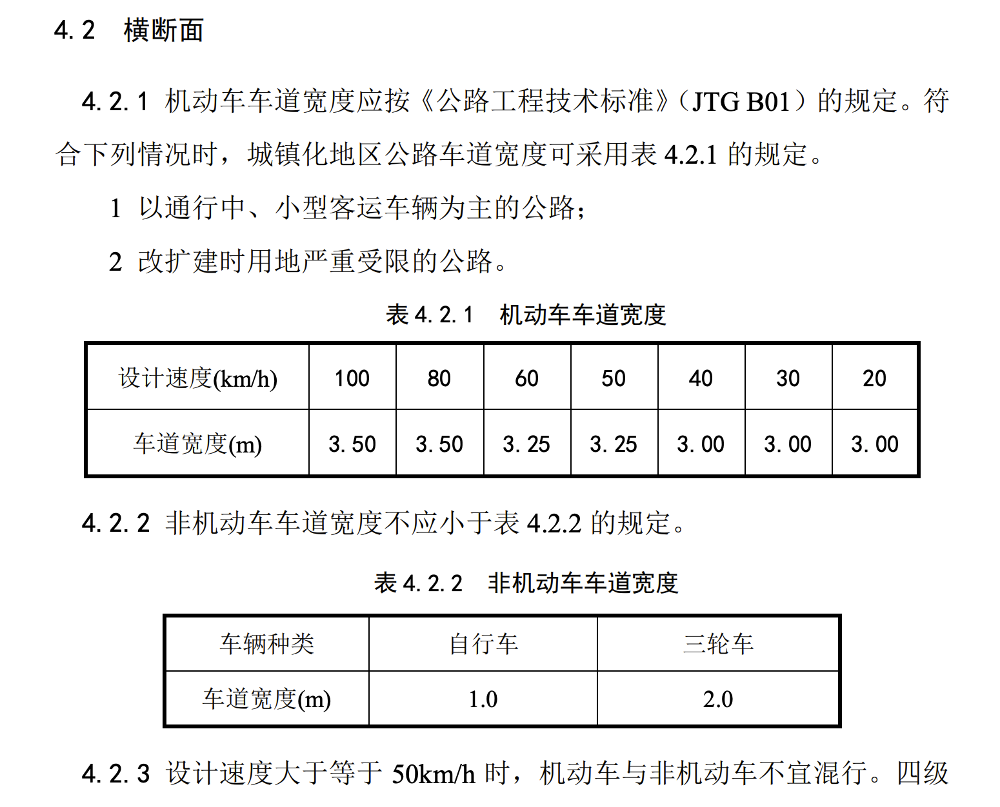

# 实践三 车速和撞线时间估计

## 标准参照物
依照国标 [《城镇化地区公路工程技术标准》（JTG 2112—2021）](https://xxgk.mot.gov.cn/2020/jigou/glj/202112/P020220106356485472287.pdf)，该路段车道宽度为3.25m

https://arxiv.org/abs/2101.06159

厂商: Huawei
模型: Honor X10
手机重量: 191g
手机尺寸: 163.7 x 76.5 x 8.8mm
操作系统版本: Android 10.0 (Q)
主屏尺寸: 6.63英寸
主屏分辨率: 2400x1080
RAM 容量: 6GB
ROM 容量: 64GB
摄像头: 40Mp Sony IMX600
40 MP, f/1.8, 26 mm ( 广角 ), 1/1.7" 传感器尺寸
Resolution  7296 x 5472, 39.92 Mega-pixels
Matrix size  7.3 mm x 5.47 mm, Diagonal: 0.46 inch
Pixel size  1 μm