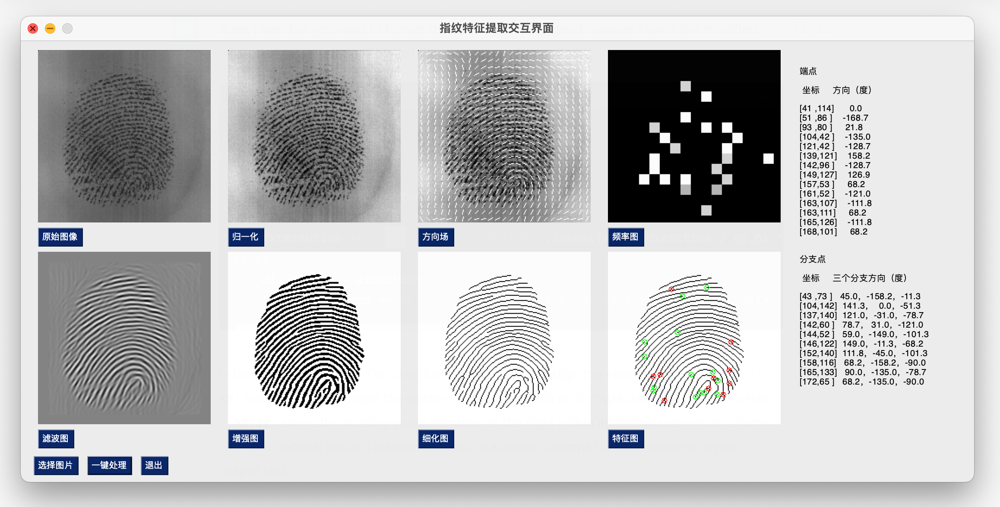

## 指纹特征提取系统

## 测试环境

- Python == 3.8
- PySimpleGUI == 4.60.5
- opencv-contrib-python == 4.8.0.76
- Numpy == 1.23.1
- Scipy == 1.9.0

## 使用方法

1. 运行`GUI.py`文件
2. 点击`选择图片`按钮，选择一张图片
3. 点击`一键处理`按钮，等待特征提取完成
4. 点击`退出`按钮，退出程序

## 参考

1. [https://github.com/KinghooWei/FingerprintFeatureExtractionAndDescription](https://github.com/KinghooWei/FingerprintFeatureExtractionAndDescription)

2. Hong L, Wan Y, Jain A. Fingerprint image enhancement: algorithm and performance evaluation[J]. IEEE transactions on pattern analysis and machine intelligence, 1998, 20(8): 777-789.